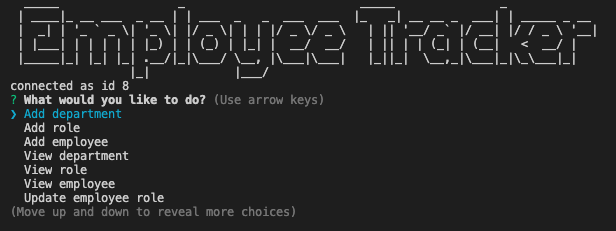

# employee-tracker

## Description

Application is meant to view and manage departments, roles and employees in a company to better organize and plan the business. 

The challenge was to architect and build a solution for managing a company's employees using node, inquirer and MySQL.

## Installation

Install:

* inquirer
* mysql
* figlet

## Usage
The command-line application allows users to:

* Add departments, roles, employees
* View departments, role, employees
* Update employee roles

## Roadmap

Instead of displaying all employee's name to look for the manager, I would identify who doesn't have a manager's id in the employee table and then filter through the department to provide a more comprehensive list. That way in a larger data set, users would be presented with a list of managers in each department. 